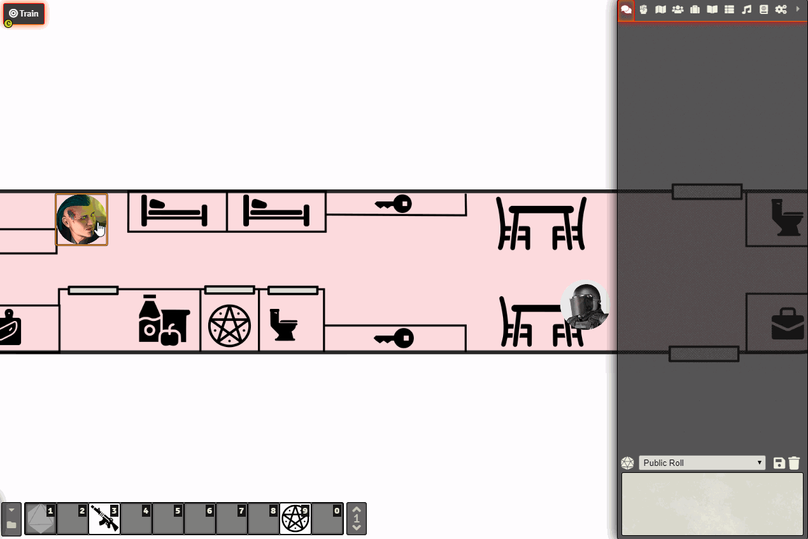

# Macro for summoning spirits in Shadowrun 5E system on FoundryVTT

Creates a spirit of chosen type and force, fills attributes, skills and powers into the sheet, spawns a token near the summoner. Most powers that require a roll have an action attached to it (can be used by pressing power's icon on spirit's character sheet).

Notes:
1. You can set default images for spirit tokens by providing file paths at the beginning of the script.
2. User requires "create actor" and "create token" persmissions.
3. After creating an actor, macro will try to spawn a token near the default character of the user. If it is set to null (GM user will always have it set to null), then it will try to create one near the first selected token. If none selected, token will not be spawned, but the actor will still be created in your actor tab (so you can drag it manually).
4. Automatic hits for spirit immunity to normal weapons (part of materialization power) are not represented.
5. Astral initiative is one d6 short, because there's no way to change it in the system yet.
